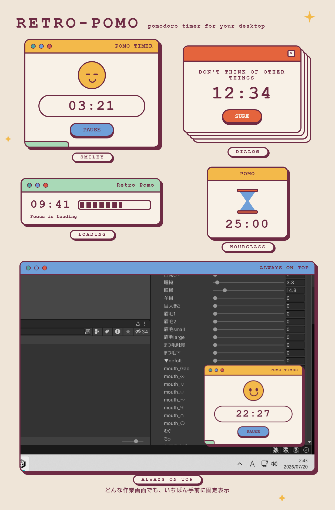

# retro-pomo

<p align="center">
  
</p>

レトロOSウィンドウ風デザインのデスクトップ常駐ポモドーロタイマー(Windows)。

A pomodoro timer widget for your desktop, styled after 90s retro OS windows.

## Features

- **4つの切替可能なレトロスキン** — Smiley(ログイン窓)/ Dialog(スタックダイアログ)/ Loading(ローディングバー)/ Hourglass(砂時計)
- 枠なし・背景透過・常に最前面の小型ウィジェット(最前面は切替可)
- 四隅ドラッグで縦横比を保ったまま拡大縮小(75〜200%)
- 作業25分 ⇄ 休憩5分の自動サイクル(分数は設定可)。フェーズ切替はレトロなチャイム音。Windows通知はオプトイン(設定のNOTIFY、デフォルトOFF)
- 右クリックの操作メニュー(日本語 / English)
- スキン・サイズ・位置・設定はすべて記憶され、再起動後に復元

## Install

[Releases](../../releases) から `retro-pomo_x.y.z_x64-setup.exe`(NSIS)または `.msi` をダウンロードしてインストール。

要件: Windows 10/11(WebView2 ランタイム。通常はプリインストール済み)

## Usage

| 操作 | 方法 |
|---|---|
| 開始 / 一時停止 | スキン上のボタン(START / SURE)または本体クリック(Loading / Hourglass) |
| 移動 | 本体をドラッグ |
| 拡大縮小 | 四隅をつかんでドラッグ(等比、離した位置で確定) |
| リセット / スキン切替 / 設定 / 言語 / 最小化 / 終了 | 右クリックメニュー |

## Development

```bash
bun install
bun run tauri dev     # 開発起動
bun run typecheck     # 型検査
bun test              # タイマーロジックのテスト
bun run tauri build   # リリースビルド (exe / msi / nsis)
```

ブラウザだけで見た目を確認: `bun run dev` → `http://localhost:1420/?skin=A|B|C|D`, `?view=settings`, `?promo=1`(宣伝画像用グリッド)

## Tech

Tauri 2 (Rust) / React 19 + Vite + TypeScript / 手書きCSS(全モチーフCSS描画・画像アセットなし)/ WebAudio チャイム

設計ドキュメント: [`docs/specs/`](docs/specs/) ・実装計画: [`docs/plans/`](docs/plans/)
